  

<!-- ================================================================= -->
<!--                       CYBERCORE OS v1.0.8                         -->
<!-- ================================================================= -->

  <!-- Boot Screen -->
  
  
    
  
  <!-- Divider -->
  
  
    

 

<!-- ================= SYSTEM INFORMATION / ABOUT ================= -->
<table align="center" width="100%">
  <tr>
    <td bgcolor="#0D0714" style="border: 1.5px solid #7C3AED; border-radius: 8px; padding: 15px;">
      
      <h2 style="color: #D946EF; margin-top: 0; font-family: monospace;">[+] SYSTEM INFORMATION</h2>
      

        <strong>OS Core:</strong> CyberCore OS v1.0.8 x86_64 
        <strong>Operator:</strong> Aditya Mohanty 
        <strong>Primary Node:</strong> Full-Stack Software Developer &amp; Cloud Explorer 
        <strong>Neural Directives:</strong> Designing resilient distributed architectures, AI agent workflows, and reactive web platforms.
      

      

        Welcome to my digital command center. Scroll down to execute modules and examine database records.
      

    </td>
  </tr>
</table>

 

  

<!-- ================= TECHNOLOGY STACK ================= -->
<h2 align="center" style="color: #7C3AED; font-family: monospace;">[0x01] COGNITIVE TECH STACK</h2>

  <!-- Languages -->
  <strong style="color: #F8FAFC; font-family: monospace;">LANGUAGES:</strong> 
  
  
  
  
  
    
  
  <!-- Frontend -->
  <strong style="color: #F8FAFC; font-family: monospace;">FRONTEND:</strong> 
  
  
  
  
  
    
  
  <!-- Backend -->
  <strong style="color: #F8FAFC; font-family: monospace;">BACKEND:</strong> 
  
  
  
    
  
  <!-- Database -->
  <strong style="color: #F8FAFC; font-family: monospace;">DATABASE:</strong> 
  
  
  
    
  
  <!-- Cloud & DevOps -->
  <strong style="color: #F8FAFC; font-family: monospace;">CLOUD / INFRASTRUCTURE:</strong> 
  
  
    
  
  <!-- Tools -->
  <strong style="color: #F8FAFC; font-family: monospace;">TOOLS &amp; UTILITIES:</strong> 
  
  
  
  

 

  

<!-- ================= GITHUB ANALYTICS ================= -->
<h2 align="center" style="color: #7C3AED; font-family: monospace;">[0x03] SYSTEM ANALYTICS</h2>

  <!-- Stats & Language Card Row -->
  <table width="100%" border="0" cellpadding="0" cellspacing="0">
    <tr align="center">
      <td width="50%" valign="top" style="padding-right: 5px;">
        
      </td>
      <td width="50%" valign="top" style="padding-left: 5px;">
        
      </td>
    </tr>
  </table>
  
   
  
  <!-- Streak Card -->
  
  
    
  
  <!-- Snake contribution grid -->
  <h3 style="color: #D946EF; font-family: monospace;">[+] CONTRIBUTION NEURAL NETWORK</h3>
  

 

  

<!-- ================= DEVELOPER TERMINAL ================= -->
<h2 align="center" style="color: #7C3AED; font-family: monospace;">[0x04] SYSTEM TERMINAL</h2>

  

 

  

<!-- ================= CURRENT MISSION & CONTACT ================= -->
<table align="center" width="100%">
  <tr align="center">
    <!-- Current Mission Card -->
    <td width="50%" valign="top" style="padding-right: 10px;">
      <table width="100%" style="border: 1.5px solid #3B82F6; border-radius: 8px;" bgcolor="#0D0714">
        <tr>
          <td style="padding: 15px; text-align: left; font-family: monospace;">
            <h3 style="color: #3B82F6; margin-top: 0;">&gt;_ CURRENT MISSION</h3>
            
Currently studying microservices configurations, optimizing GenAI pipeline latency, and writing high-frequency code generators in Python.

            
Next node: Cloud Certification (GCP Cloud Architect)

          </td>
        </tr>
      </table>
    </td>
    <!-- Contact Info Card -->
    <td width="50%" valign="top" style="padding-left: 10px;">
      <table width="100%" style="border: 1.5px solid #D946EF; border-radius: 8px;" bgcolor="#0D0714">
        <tr>
          <td style="padding: 15px; text-align: left; font-family: monospace;">
            <h3 style="color: #D946EF; margin-top: 0;">&gt;_ ESTABLISH COMMS</h3>
            
Open for collaborations, software consulting, and open-source integrations.

            
            
          </td>
        </tr>
      </table>
    </td>
  </tr>
</table>

 

  <!-- Footer Divider -->
  
  
    
  
  <!-- Shutdown Screen -->
  

